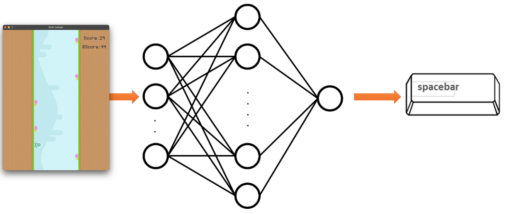

# Snail Jumper: Evolutionary Neural Network Training

## Overview

Snail Jumper is a game where an agent continuously bypasses obstacles by jumping left and right. The goal is to train a
neural network to control the agent's actions. However, due to the continuous stream of new events, there is not enough
data available to train the model. To overcome this
limitation, evolutionary algorithms are used to optimize the neural network's weights and biases.

For the complete description of the project, please refer to the [instructions.pdf](docs/instructions.pdf), which explains the game and the solution algorithm in detail, in
Persian.

## Evolutionary Algorithm

The solution involves initializing a generation of 300 agents, each with their own random weights and biases for the
neural network. Each agent performs a sequence of actions based on their neural network, progressing in the game. The
fitness of each agent is measured by the amount of progress it has made in the game. The more an agent can keep going,
the higher its fitness value.

Following the evolutionary strategy, agents with better performance are selected to populate the next generation using
crossover and mutation operations. After a few generations, the agents' performance improves significantly.

## Implementation

### `nn.py`

The `nn.py` file creates and initializes the neural network with random weights. It implements the feedforward function
for a neural network with a [7, 10,2] layer size architecture by default. This means there are 7 input neurons, 10
hidden neurons, and 2 output neurons.

### `evolution.py`

The `evolution.py` file contains the following methods:

- `next_population_selection`: Decides the strategy for selecting agents. **Top-K**, **Roulette wheel**, **SUS**, and *
  *Q-Tournament**
  strategies are implemented.
- `generate_new_population`: Handles parent selection and generates new agents. The mentioned strategies are implemented
  for parent selection. Crossover and mutation are applied to pairs of selected parents.

### `visualize.py`

The `visualize.py` file plots the learning curve, which contains the max, min, and average fitness of each generation.

## Results

An example of the learning curve mentioned above can be seen below.

## Demo

## Credits

This project was designed by Soroush Mehraban and Kasra Mojallal, who also provided the starter code for the game. The
logic behind the neural network, the evolutionary algorithm and their visualization is implemented by me.

## Course Information

- **Course**: Computational Intelligence
- **University**: Amirkabir University of Technology
- **Semester**: Fall 2021

Let me know if you have any questions.
